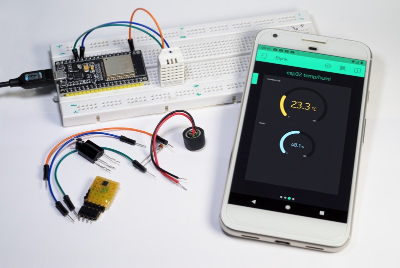

Maker Media GmbH

***

# Internet-of-Things-Dienste für Maker

### In diesem Artikel aus Make 3/21 zeigen und vergleichen wir ein paar IoT-Dienste für Maker.

 

Hier finden Sie den Code aus den Beispielen.

Den vollständigen Artikel  gibt es in der [Make-Ausgabe 3/21 ab Seite 32](https://www.heise.de/select/make/). 

